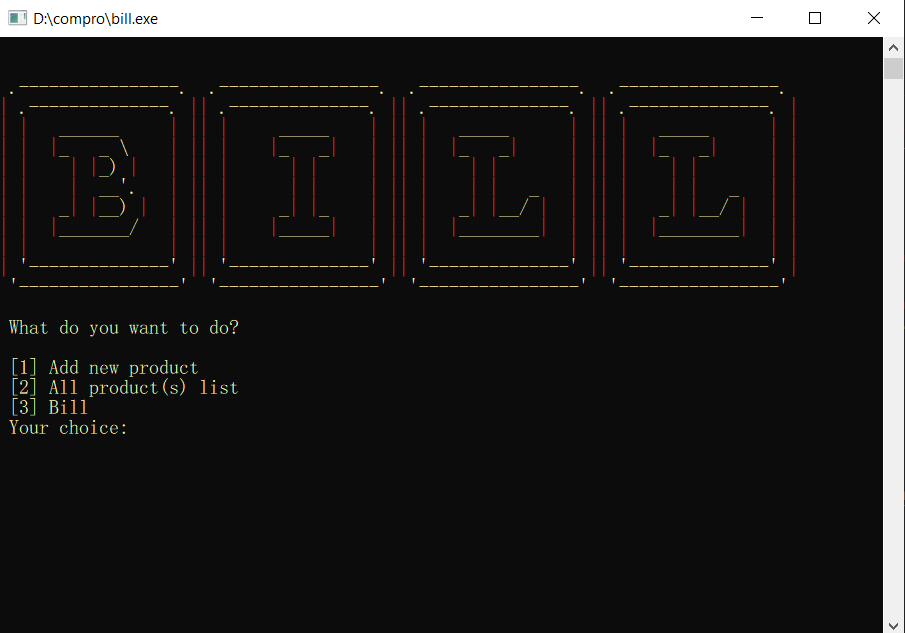
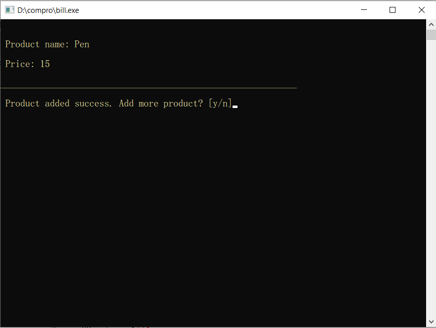
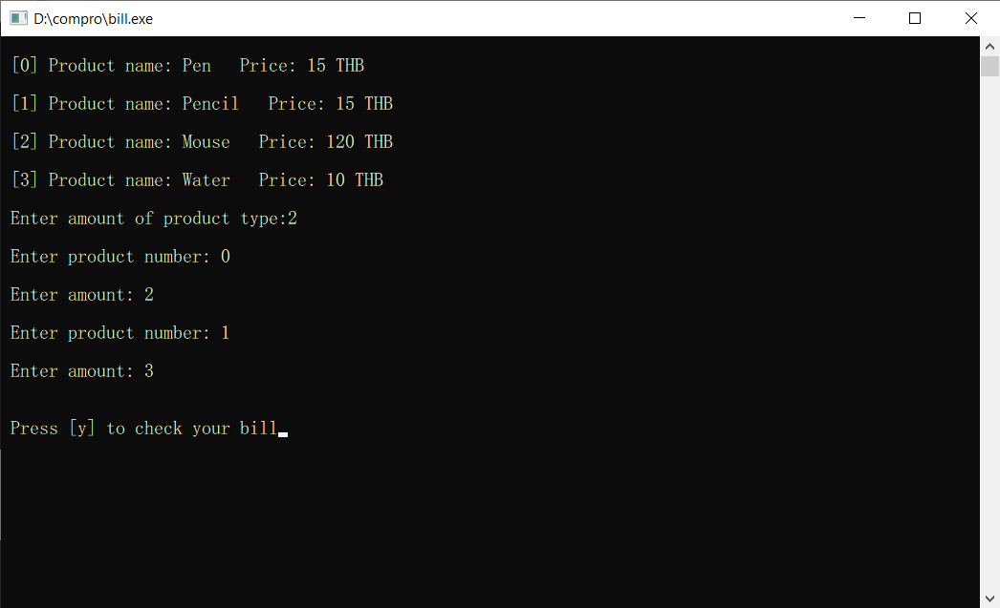

# [CHECK BILL](https://checkbill.netlify.app/?fbclid=IwAR0TE4nDql008fRbf0Rc8LJ4eyO8noltVGIVPq1V-ZVs8BaL8t-0rpTpKpE)
## Abstract 
เป็น Mini Project วิชา Computer Programming พัฒนาเกี่ยวกับApplication โดยมีวัตถุประสงค์ในการนำความรู้ทางด้าน Programming ภาษา C มาประยุกต์ในการสร้างชิ้น งานชิ้นนี้ ซึ่งApplication ที่ทางจัดทำสร้างขึ้นมีแนวคิดมาจากการซื้อขายของทั่วไป โดยที่วัตถุประสงค์ของApplication คือการคำนวณราคาของสินค้าที่มีอยู่ในระบบเพื่อความสะดวกสบาย และประหยัดเวลาของผู้ใช้งานในการคำนวณราคาสินค้า หลายๆชิ้นและหลายๆสินค้าในระบบ รวมไปถึงเมื่อมีสินค้าใหม่เข้ามาก็สามารถเพิ่มเข้าไปในApplicationได้ เพื่อใช้สำหรับในการคำนวณราคาของสินค้าต่อไป
## การทำงานของแอพพลิเคชั่น
หน้าแรกของโปรแกรมจะประกอบด้วย3เมนูให้เลือก ผู้ใช้งานเลือกได้ด้วยการพิมพ์เลขด้านหน้าเมนูที่ต้องการ

### * เมนูแรก[1]
เป็นระบบเพิ่มสินค้า โดยระบบจะให้ผู้ใช้งานกรอกชื่อสินค้า และราคา เมื่อผู้ใช้ทำการเพิ่มสินค้าสำเร็จระบบจะสอบถามว่าต้องการเพิ่มสินค้าอีกหรือไม่ ถ้าไม่จะกลับสู่หน้าเมนูหลัก

### * เมนูที่สอง[2]
จะเป็นการแสดงลิสต์ของสินค้าที่ผู้ใช้ได้ทำการเพิ่มเข้าไปในระบบ

### * เมนูสุดท้าย[3]
	 * ส่วนแรกจะเป็นการทำบิลโดยรับข้อมูลสินค้าและจำนวนจากผู้ใช้
	
	* ส่วนต่อมาจะเป็นหน้าที่แสดงชื่อสินค้า ราคา จำนวน และรวมเงินที่ต้องจ่าย ซึ่งคำนวณจากการรับค่าจากส่วนที่แล้ว
	

